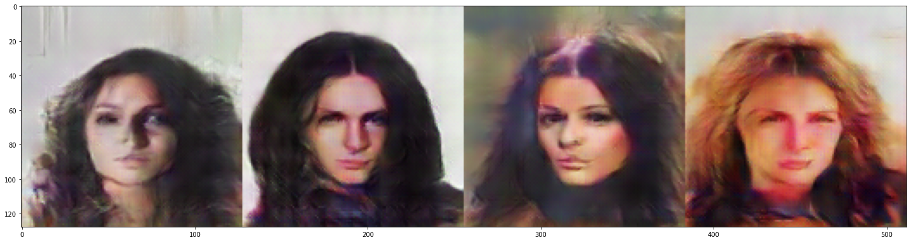

# CELEBA-DCGAN

### Celeba DCGAN testes and training

### Aprendizado retirado do livro "Hands-On Generative Adversarial Networks with Pytorch 1.x", **John Hany and Greg Walters**

1. Trabalho para aprendizado sobre DC-GAN, utilizando o dataset de imagens de faces. Para download das imagens, acessar o documento [DOWNLOAD-DATASET-FROM-GDRIVE.ipynb](./DOWNLOAD-DATASET-FROM-GDRIVE.ipynb).  

1. Variáveis adotadas para o treinamento: 
```
NOISE_DIM = 100
BATCH_SIZE = 128
EPOCHS = 100
IMG_SIZE = 128
LEARNING_RATE = 0.0002
```

3. Imagens reais:  


4. Generator: 
```
Sequential(
  (0): ConvTranspose2d(100, 1024, kernel_size=(4, 4), stride=(1, 1), bias=False)
  (1): BatchNorm2d(1024, eps=1e-05, momentum=0.1, affine=True, track_running_stats=True)
  (2): ReLU(inplace=True)
  (3): ConvTranspose2d(1024, 512, kernel_size=(4, 4), stride=(2, 2), padding=(1, 1), bias=False)
  (4): BatchNorm2d(512, eps=1e-05, momentum=0.1, affine=True, track_running_stats=True)
  (5): ReLU(inplace=True)
  (6): ConvTranspose2d(512, 256, kernel_size=(4, 4), stride=(2, 2), padding=(1, 1), bias=False)
  (7): BatchNorm2d(256, eps=1e-05, momentum=0.1, affine=True, track_running_stats=True)
  (8): ReLU(inplace=True)
  (9): ConvTranspose2d(256, 128, kernel_size=(4, 4), stride=(2, 2), padding=(1, 1), bias=False)
  (10): BatchNorm2d(128, eps=1e-05, momentum=0.1, affine=True, track_running_stats=True)
  (11): ReLU(inplace=True)
  (12): ConvTranspose2d(128, 64, kernel_size=(4, 4), stride=(2, 2), padding=(1, 1), bias=False)
  (13): BatchNorm2d(64, eps=1e-05, momentum=0.1, affine=True, track_running_stats=True)
  (14): ReLU(inplace=True)
  (15): ConvTranspose2d(64, 3, kernel_size=(4, 4), stride=(2, 2), padding=(1, 1), bias=False)
  (16): Tanh()
)
```

5. Discriminator: 
```
Sequential(
  (0): Conv2d(3, 32, kernel_size=(3, 3), stride=(2, 2), padding=(1, 1), bias=False)
  (1): LeakyReLU(negative_slope=0.2)
  (2): Conv2d(32, 64, kernel_size=(4, 4), stride=(2, 2), padding=(1, 1), bias=False)
  (3): BatchNorm2d(64, eps=1e-05, momentum=0.1, affine=True, track_running_stats=True)
  (4): LeakyReLU(negative_slope=0.2)
  (5): Conv2d(64, 128, kernel_size=(4, 4), stride=(2, 2), padding=(1, 1), bias=False)
  (6): BatchNorm2d(128, eps=1e-05, momentum=0.1, affine=True, track_running_stats=True)
  (7): LeakyReLU(negative_slope=0.2)
  (8): Conv2d(128, 256, kernel_size=(4, 4), stride=(2, 2), padding=(1, 1), bias=False)
  (9): BatchNorm2d(256, eps=1e-05, momentum=0.1, affine=True, track_running_stats=True)
  (10): LeakyReLU(negative_slope=0.2)
  (11): Conv2d(256, 512, kernel_size=(4, 4), stride=(2, 2), padding=(1, 1), bias=False)
  (12): BatchNorm2d(512, eps=1e-05, momentum=0.1, affine=True, track_running_stats=True)
  (13): LeakyReLU(negative_slope=0.2)
  (14): Conv2d(512, 1024, kernel_size=(4, 4), stride=(2, 2), padding=(1, 1), bias=False)
  (15): BatchNorm2d(1024, eps=1e-05, momentum=0.1, affine=True, track_running_stats=True)
  (16): LeakyReLU(negative_slope=0.2)
  (17): Conv2d(1024, 1, kernel_size=(4, 4), stride=(1, 1), padding=(1, 1), bias=False)
  (18): Sigmoid()
)
```
6. Resultado após algumas épocas:  


### Análise dos resultados e testes

7. Depois do modelo **generator** treinado, podemos utilizar o código [Interpolation-Images-CELEBA.ipynb](./Interpolation-Images-CELEBA.ipynb) para fazer alguns testes.  
O primeiro é uma amostra de algumas imagens geradas pelo modelo:  


8. Podemos fazer, então, uma interpolação entre dois vetores, conforme resultados abaixo:  

  


9. Por último, podemos criar um gif com essas interpolações:  
 

# SEMANTIC VECTOR ARITHMETIC

10. Também podemos realizar operações vetoriais com as expressões, como:  

* Imagens de mulheres:  


* Imagens de mulheres sorrindo:  


* Tiramos a média desses vetores, como:  
```
serious_mean = np.mean(serious_woman, axis=0)
smiling_mean = np.mean(woman_smiling, axis=0)

smiling_vector = smiling_mean - serious_mean
smiling_tensor = torch.tensor(smiling_vector).unsqueeze_(0)
```

* E podemos somar a uma imagem, por exemplo, de uma pessoa séria (sem estar sorrindo):  
```
smiling_man = serious_man + smiling_tensor
```

